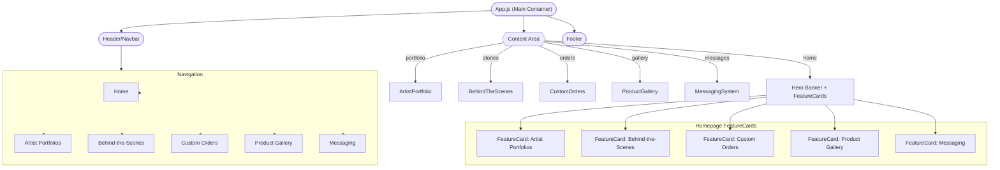

# CreativeConnect Main Container: Component Structure & Layout Documentation

## Overview

The main React container (`App.js`) for CreativeConnect serves as the entry point and orchestrator for all core features, navigation, and layout. This document provides a comprehensive summary of the container's structure, flows between its major feature modules, visual navigation, and fulfillment of design requirements. It includes a hierarchical component outline and a mermaid-based diagram for quick architectural reference.

---

## 1. High-Level Structure

The `App.js` file implements a classic "single-page app" (SPA) structure using React local state (not router-based navigation):

- **Header:** Persistent maroon navigation bar (branding, navigation buttons for all feature modules).
- **Home/Main Content:** Switches between:
  - **Homepage Hero:** Engaging welcome, platform description, and quick links to all module features.
  - **Dynamic Section View:** Renders the currently selected feature component (module).
- **Footer:** Sticky, styled maroon/gold brand footer.

Central navigation and display logic is handled via a `section` state, determining which major feature is rendered in the content area. All feature modules are directly imported as React children.

### Summary of Integration & Navigation

- Feature modules are loosely coupled: each is a self-contained React component file.
- Navigation between features is achieved by setting local state, not by route changes, ensuring fast and extensible control.
- Style/theme is unified across modules via shared CSS classes and CSS variables defined in `App.css`.

---

## 2. Component & Layout Hierarchy

```
App.js
 ├── Header (div.header)
 │     ├── Logo ("ArtistryHub" + icon)
 │     └── Nav Bar (ul.navbar-list > Navigation Buttons: Home, Artist Portfolios, Behind-the-Scenes, Custom Orders, Product Gallery, Messaging)
 ├── Content Area (dynamic, based on section state)
 │     ├── Hero + FeatureCards (when section === 'home')
 │     │     ├── FeatureCard: Artist Portfolios
 │     │     ├── FeatureCard: Behind-the-Scenes
 │     │     ├── FeatureCard: Custom Orders
 │     │     ├── FeatureCard: Product Gallery
 │     │     └── FeatureCard: Messaging
 │     └── [Feature Module] (when section !== 'home')
 │           ├── ArtistPortfolio.js
 │           ├── BehindTheScenes.js
 │           ├── CustomOrders.js
 │           ├── ProductGallery.js
 │           └── MessagingSystem.js
 └── Footer (div.footer)
```

### Mermaid Diagram



---

## 3. Feature Module Summaries & UI Flows

- **ArtistPortfolio:** Displays a styled grid of artist profile cards; each card with avatar, name, bio, and art gallery images. Presentational, with mock data for demo.
- **BehindTheScenes:** Shows a timeline/feed of "stories" from creators. Each story has an image, creator, timestamp, and description in a branded card layout.
- **CustomOrders:** Lists mock custom order requests. Each order renders a card with buyer/artist avatars, custom item detail, and a nested message thread between buyer/artist.
- **ProductGallery:** Responsive grid of artwork/craft images, each with title and artist, using the same branding and card system as other modules.
- **MessagingSystem:** Fully interactive UI (mock data only): shows a contacts list, chat history per contact, unread indicators, and a message input box. No backend integration; all state is local.

Each feature is isolated and invoked by navigation selection. State flow is one-way: the main container decides which feature is visible, and feature modules render independently.

---

## 4. Navigation & State Flow

- Navigation is handled within `App.js` by setting the `section` state (`useState`).
- The App's top navigation updates the current section, which conditionally renders the required component.
- Feature modules are unaware of each other and of their navigation context (stateless except for their own UI state).
- Homepage invokes module switch either via nav bar or "FeatureCard" action buttons.
- No URL routing, no context providers, no global state.

---

## 5. Styling, Branding, and Layout Systems

- All CSS variables, themes, and utility classes are defined in `App.css` (`:root`).
- Brand archetype: Maroon (primary), Gold (accent), White (background), with consistent shadowing, radius, and button/message styles.
- Reusable classes: `.app`, `.header`, `.footer`, `.container`, `.card`, `.grid`, and utility classes for flex, typography, and colors.
- Components leverage both shared classes and inline style for quick customization.
- Layout is fully responsive with adaptive grid for cards and content areas.

---

## 6. Fulfillment of Requirements

- **Feature module integration:** All features listed in requirements are implemented as importable modules and are already integrated and selectable via navigation/state.
- **Navigation:** Top bar offers fast switching between modules. Sectional navigation is clear and always visible.
- **Style & Brand Consistency:** All sections use the same brand color palette, spacing, and component style, aligned with `App.css`.
- **Extensibility:** Adding new modules requires only a new case in App.js and a nav button — no changes to other modules are required. All module files are decoupled and easily maintainable.
- **State & Navigation Flow:** State for navigation is locally managed, reducing complexity and facilitating easy refactor or router addition in the future.

---

## 7. Extending This Container

To add new features/modules:
- Create a new component in `src/components/`.
- Import it in `App.js`, add an entry to `SECTIONS`, and extend the navigation bar and `renderSection()` switch.

To update branding or global styles:
- Edit variables and class rules in `src/App.css`.

---

## 8. Sources

Derived from:
- `src/App.js`
- `src/components/ArtistPortfolio.js`
- `src/components/BehindTheScenes.js`
- `src/components/CustomOrders.js`
- `src/components/ProductGallery.js`
- `src/components/MessagingSystem.js`
- `src/App.css`

